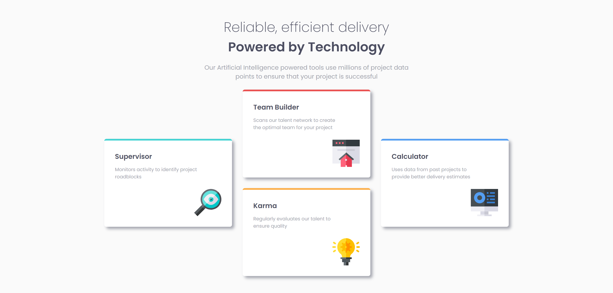

# Frontend Mentor - Four card feature section solution

This is a solution to the [Four card feature section challenge on Frontend Mentor](https://www.frontendmentor.io/challenges/four-card-feature-section-weK1eFYK). Frontend Mentor challenges help you improve your coding skills by building realistic projects. 

## Table of contents

- [Overview](#overview)
  - [The challenge](#the-challenge)
  - [Screenshot](#screenshot)
  - [Links](#links)
- [My process](#my-process)
  - [Built with](#built-with)
  - [What I learned](#what-i-learned)
  - [Useful resources](#useful-resources)
- [Author](#author)
- [Acknowledgments](#acknowledgments)


## Overview

### The challenge

Users should be able to:

- View the optimal layout for the site depending on their device's screen size

### Screenshot




### Links

- Solution URL: [Github](https://github.com/KhadeejathulHumaira/gridFrontend)
- Live Site URL: [Website]()

## My process

### Built with

- Semantic HTML5 markup
- CSS custom properties
- Flexbox
- CSS Grid
- Mobile-first workflow


### What I learned

Use this section to recap over some of your major learnings while working through this project. Writing these out and providing code samples of areas you want to highlight is a great way to reinforce your own knowledge.

To see how you can add code snippets, see below:

```html
<h1>Some HTML code I'm proud of</h1>
```
```css
.proud-of-this-css {
  color: papayawhip;
}
```
```js
const proudOfThisFunc = () => {
  console.log('🎉')
}
```


### Useful resources

- [Example resource 1](https://css-tricks.com/snippets/css/a-guide-to-flexbox/) - This helped me a lot to clear my doubts .
- [Example resource 2](https://www.youtube.com/watch?v=FTlczfR82mQ) 


## Author
- Website - [Humaira](https://humaira.netlify.app/)
- Frontend Mentor - [@KhadeejathulHumaira](https://www.frontendmentor.io/profile/KhadeejathulHumaira)
- Twitter - [@humaiz14](https://twitter.com/humaiz14)


## Acknowledgments
 I would like to thank all those good hearts who gave feedback for  my last submission.


